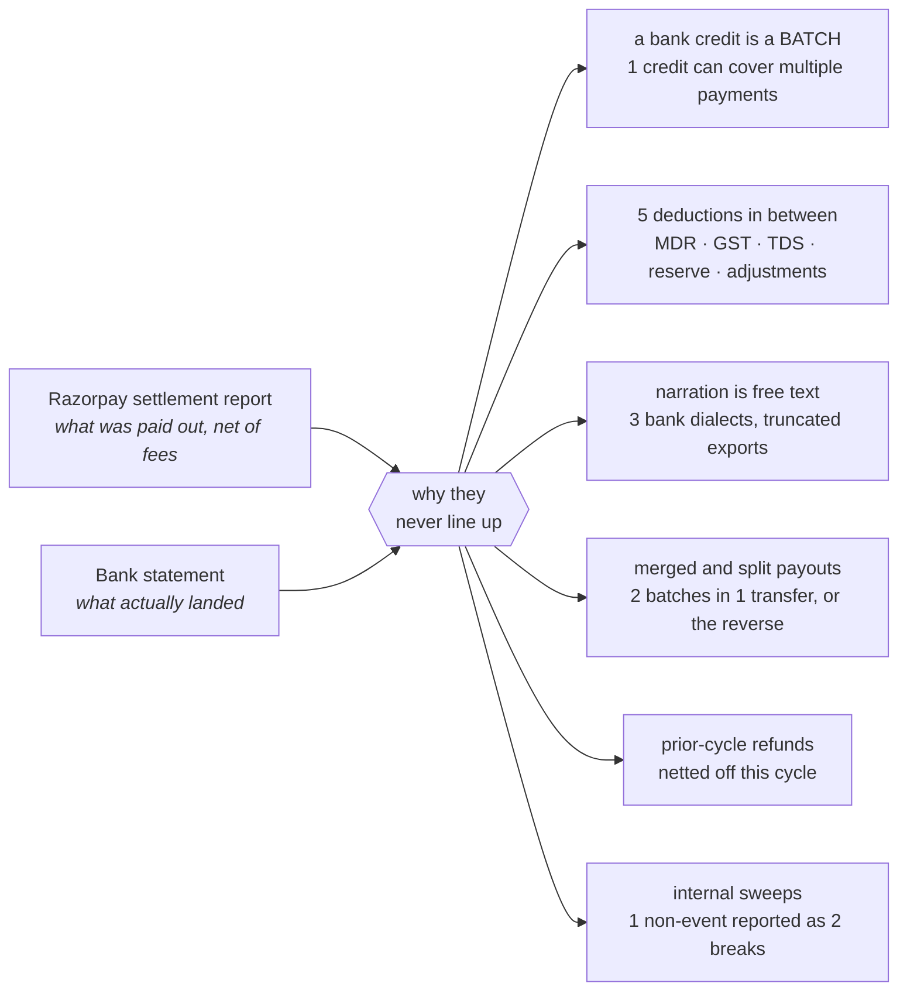
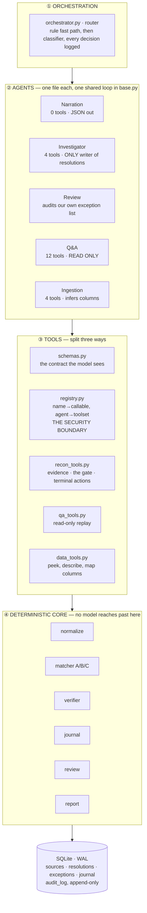
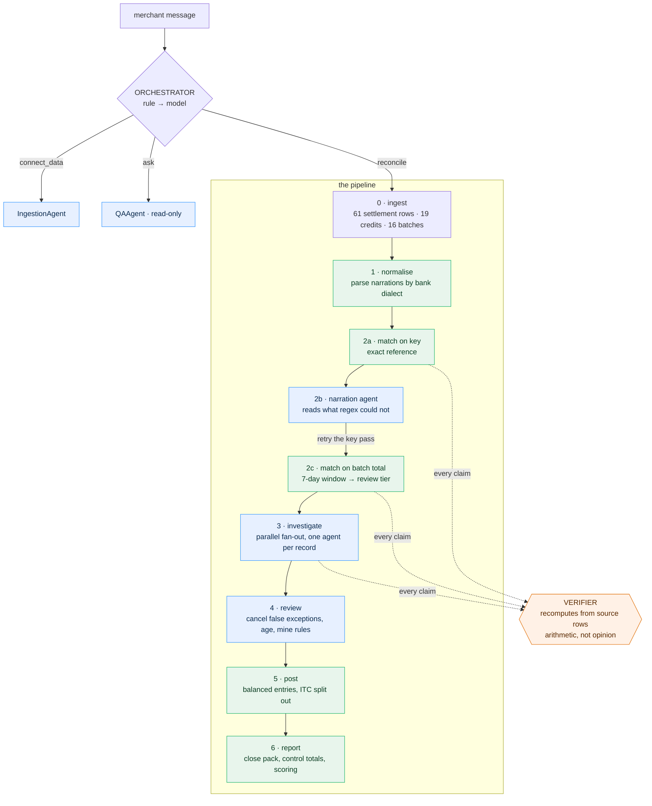
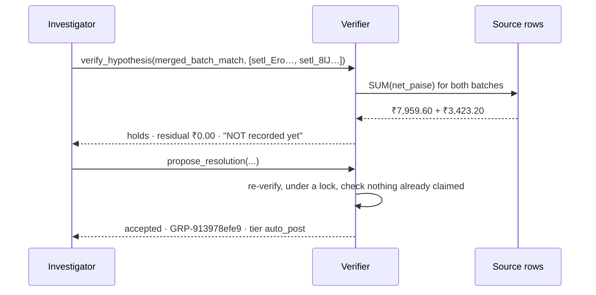
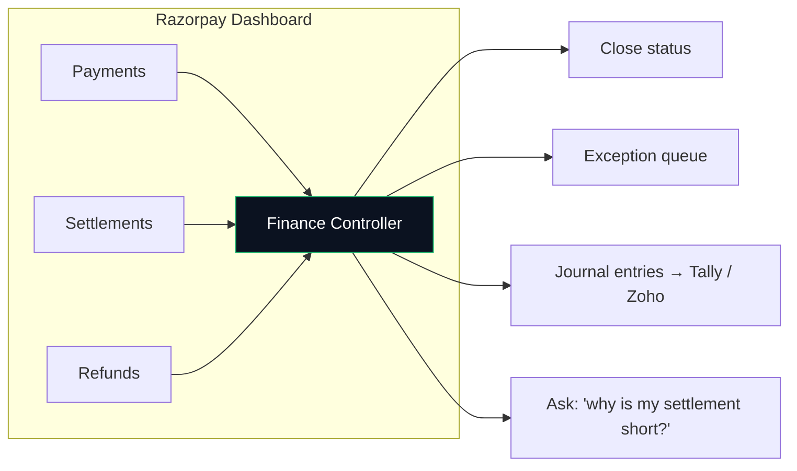

# AI Finance Controller

**Razorpay AI Buildathon · Track 04**
A reconciliation agent that runs inside the dashboard a merchant already uses.

---

## 1. The problem

Two sources describe the same money. They rarely agree cleanly.

**Razorpay settlement data** tells us what was paid out after fees and deductions. The **bank statement** tells us what actually landed. Connecting the two sounds simple until real-world payout behaviour gets involved.

Today this is Excel, VLOOKUP and eyeball, for days, every month. And the part that matters most — the handful that genuinely does not reconcile — gets rushed because it comes last.

**Our position:** an unresolved item is a finding, not a failure. A tool that reports 100% is either lucky or lying, and the second one is worse than useless because a controller will sign against it.

---

## 2. The data we work on

Real Razorpay settlement data and real bank narration mess.

**Bank statement.** Narrations can use different formats, references can appear in unexpected positions, and some credits may have no usable settlement reference at all. Internal sweeps can also appear as bank movements even though they are not genuine settlement activity.

**Settlement report.** Many rows can share one `settlement_id`. That represents a settlement batch. The final bank credit reflects the net amount after applicable fees, taxes, TDS, reserves and other adjustments.

### Why the two sources do not line up cleanly



Each payout mode is seeded on purpose, so all three difficulty tiers are populated:

| **Bank shows**                     | **Who closes it**                                |
| ---------------------------------- | ------------------------------------------------ |
| settlement id in the narration     | exact key, deterministic                         |
| UTR only, or id in the wrong place | narration agent, then exact key                  |
| no reference, amount exact         | batch total, deterministic, review tier          |
| **two batches in one transfer**    | **investigator**                                 |
| **one batch across two credits**   | **investigator**                                 |
| **a few paise short**              | **investigator**, immaterial, booked to rounding |
| money from nobody                  | nobody. Escalated, honestly                      |

---

## 3. Architecture

A sequential backbone, a router at the front, one parallel fan-out inside. Not a swarm.

Reconciliation stages are known in advance, so a supervisor that re-plans every turn buys nothing and costs debuggability.



Green is deterministic, blue uses a model, orange is the gate.

**2b sits between the two deterministic passes on purpose.** A reference key is stronger evidence than a matching amount, so we exhaust every way of recovering a key, including asking the model, before falling back to amount-and-date.

Running them the other way round manufactures false positives that look immaculate. That was a real bug here, and it produced no error at all. The match rate simply went up.

---

## 4. End-to-end flow

A merchant can interact with the system through the dashboard. The orchestrator determines whether the request is about connecting data, asking a question, or running reconciliation.



---

## 5. The harness

Four layers. Each knows only the layer below it, and the boundaries are enforced in code, not requested in a prompt.

### Capability boundaries are structural

`registry.dispatch` refuses a tool outside the caller's allow-list before the function is even looked up.

The Q&A agent has no path to `propose_resolution` or `escalate`, so nothing a user types in the chat box can change a reconciliation outcome.

That holds even if the model is jailbroken.

### Every agent is bounded and logged

`max_turns` is enforced by the loop, not asked of the model.

Each tool call is written to the audit trail before its result is handed back, so a run that crashes halfway still leaves a readable trace.

### Toolsets are deliberately small

Schemas are re-sent every turn.

The investigator carries 4 tools, not 12, and its brief arrives with the searches already run.

Rule: *if deterministic code already computed it, hand it over.*

Run time went **302s → 76s**, while turns per record went from **5 → 1–2**.

---

## 6. The verifier

The load-bearing invariant:

> **The agent may never certify its own match.**

It came from a real failure.

Early on the agent wrote:

*"this credit corresponds to settlement batch setl_2026070301, net of gateway fees."*

It read perfectly. It was wrong by **₹27,767**.

That is the failure mode that matters in finance: not a crash, but a plausible sentence attached to money that is not there.

Four claim types, each with its own arithmetic:

* `batch_match`
* `merged_batch_match`
* `split_payout_match`
* `payment_decomposition`

A rejection returns the exact residual in paise, which becomes the agent's next clue.

Rejections are logged, not swallowed.

### Verification flow



The important distinction is that **verification does not record the match**.

The agent first asks whether a hypothesis is valid. Only after the proposed resolution is submitted does the verifier re-check the arithmetic, locking and claim state before allowing it to be recorded.

### Tested rather than asserted

`demo/smoke_agent.py` drives the loop with a scripted model that proposes a plausible but wrong match:

```text
[reject]   rejected -- ₹-27,767.02 unexplained
[reject]   resolution refused by verifier
[warn  ]   escalated as EXC-d5544d29
PASS — the agent cannot certify a match the arithmetic rejects.
```

---

## 7. What the merchant gets

The merchant gets a complete close rather than a single opaque match percentage.

The controller can see:

* close status
* matched and unresolved settlements
* aged exceptions
* control totals
* reconciliation findings
* journal entries
* ITC and TDS information
* the reasoning trail behind difficult records

Every hard record shows its working, read back from the append-only audit log.

Merged payouts, split payouts and small residual differences are handled explicitly rather than silently absorbed.

Unresolved items remain visible with the evidence already ruled out, rather than being forced into a match.

The Q&A layer can then replay the audit trail when the merchant asks why a settlement is short instead of re-reasoning from scratch.

---

## 8. Where this ships

The product is designed as a tab inside the Razorpay dashboard, next to Payments and Banking+, driven by the same agentic chat.



Razorpay is the right place to run this, and the reason is the data position, not the model.

* **The settlement side is already first party.** The settlement report, payments, refunds, disputes and fee schedule are already keyed and current. The merchant supplies their bank statement, and a bank connection can remove even that step.
* **The failures are known, not inferred.** Razorpay knows which payouts it merged, which it split, which reserve it withheld and when it releases. Most of what a third party must reason its way to, the gateway can simply state.
* **Fees are found money.** 18% GST on MDR is claimable input tax credit when properly itemised, while TDS can also be surfaced as a recoverable amount.
* **It fits the agentic dashboard as-is.** Our orchestrator is already a router. "Run my reconciliation", "why is this short", and "here is my statement" each route to a specialist. No new navigation to learn.

---

## 9. Run it

### Start the dashboard

```bash
python3 -m venv .venv
.venv/bin/pip install -r requirements.txt

cp .env.example .env
# add your GROQ_API_KEY

.venv/bin/python app.py
# dashboard at http://127.0.0.1:8000
```

### Run the deterministic demo

```bash
.venv/bin/python cli.py demo --offline
```

No API key is required for the deterministic layers.

### Inspect verifier rejections

```bash
.venv/bin/python cli.py rejections
```

### Run the agent verification test

```bash
.venv/bin/python demo/smoke_agent.py
```

### Run reconciliation tier tests

```bash
.venv/bin/python demo/smoke_tiers.py
```

These tests verify that the reconciliation tiers land correctly and that the books tie.

---

## 10. Design principles

### 1. Deterministic code handles what can be deterministic

Normalization, exact-key matching, arithmetic verification, journal balancing and control totals should not depend on an LLM.

### 2. AI is used where interpretation is actually needed

The model is used for narration interpretation, investigation and natural-language Q&A — not as the source of truth for financial arithmetic.

### 3. The model proposes; the verifier decides

No agent can certify its own financial resolution.

### 4. Exceptions are first-class outputs

An unresolved record is not treated as a system failure. It is surfaced, explained and escalated.

### 5. Auditability is part of the product

Every meaningful action is logged. The system can explain not only the final answer, but how it got there.

### 6. Security boundaries are enforced in code

Agents receive explicit toolsets. The Q&A agent is read-only. Terminal reconciliation actions are protected behind the verifier.

---

## 11. The core idea

The goal is not to build an LLM that *sounds* like a finance controller.

The goal is to build a finance controller where:

**AI handles ambiguity.
Deterministic code handles money.
The verifier handles trust.
The audit trail handles accountability.**

That is what makes the system suitable for financial reconciliation rather than just another AI matching demo.
